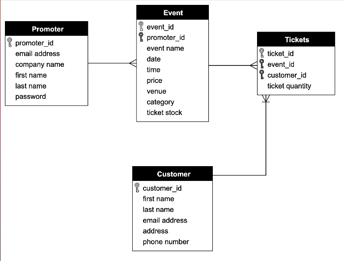

# rails-ticket-app

Co-project between Mel and Josh.
The plan is to create a ticketing app with a back end just for promoters ie clients.tickets.com.  Here they can create events and other functionality.  They will then be deployed to tickets.com which is a stylised front end for customers wishing to purchase a ticket.

## BASIC USER STORIES
As a promoter,
So that I can sell tickets to an event,
I want to be able to create an account on tickets.com

As a promoter,
for security,
I want to be able to log in and log out of my account

As a promoter,
so that i can promote my events,
I want to be able to create an event.

As a customer,
so that I can decide which event to attend,
I want to view a list of available events.

As a customer,
so that I can go to an event,
I want to buy a ticket.
=======

Trello board : https://trello.com/b/2bF7hr55/rails-ticketing-app

